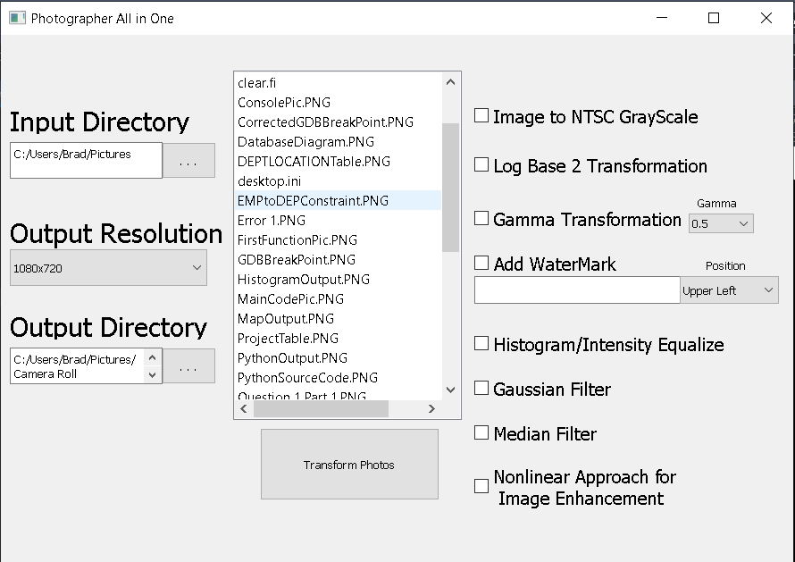

# Photographer-All-In-One
---
This is a program designed for photographers to mass edit or watermark photos (.jpg || .png)  
You can run this program from any folder (it does not have to be in the folder of the photos) using  
``python main.py``
 
## Some Features Include
- Watermark in Upper Left, Upper Right, Bottom Left, Bottom Right
- Convert All Images to the National Television System Committee standard for RGB to Grayscale
- Equalize All Color Images using histogram equalization
- Equalize All Grayscale Images using histogram equalization (program will apply to grayscale or color image)
- Apply a Log Base transformation to grayscale images (program will apply to grayscale or color image)
- Apply a Gaussian Filter to all images (program will apply to grayscale or color image)
- Apply a Median Noise Reduction Filter to all images (program will apply to grayscale or color image)

## Photo of Application
---

